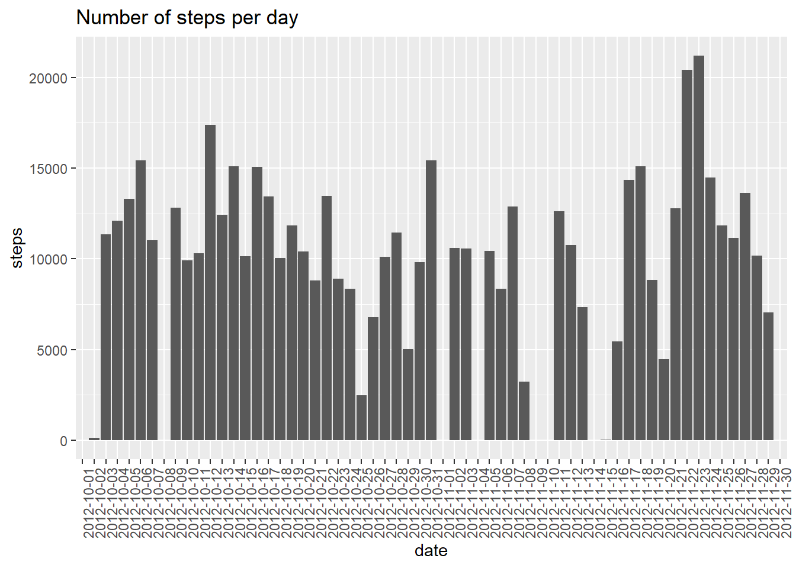

# Steps data

Load the necessary packages
```{r}
library(ggplot2)
library(dplyr)
```

Read the .csv file.
```{r}
myDT <- read.csv("activity.csv")
```

Now we group the dataset by date
```{r}
myDT %>% group_by(date) %>% summarise(steps = sum(steps))
g <- ggplot(myDT, aes(x = date, y = steps))+geom_bar(stat="identity")+theme(axis.text.x = element_text(angle = 90))+labs(title = "Number of steps per day")
g
```

For calculating the mean and median, we use the summarise again:
```{r}
myMean <- myDT %>% group_by(date) %>% summarise(mean = mean(steps), median = median(steps))
myMean
```

If we want to plot in a time series basis, it is similar as we plot before.
```{r}
g <- ggplot(myMean, aes(x = date, y = mean))+geom_bar(stat="identity")+theme(axis.text.x = element_text(angle = 90))+labs(title = "Number of steps per day")
g
```

To retrieve the interval with highest average, we use this code:
```{r}
myDT[which.max(myDT$interval), ]
```

To impute NAs, we will use a simple random imputing method from the Hmisc package. We could have used mean imputing, but since NA values are very close one to another, it does not give good results. In this case it would be better to delete them:
```{r}
library(Hmisc)
myDT[,1] <- impute(myDT[,1], 'random')
```

Now we plot the new histogram
```{r}
myDT %>% group_by(date) %>% summarise(steps = sum(steps))
g <- ggplot(myDT, aes(x = date, y = steps))+geom_bar(stat="identity")+theme(axis.text.x = element_text(angle = 90))+labs(title = "Number of steps per day")
g
```

Now we want to compare average steps taken during weekdays and during weekends, in a per 5 minutes interval basis:
```{r}
myDT$date <- as.Date(myDT$date)
myDT$datetype <- sapply(myDT$date, function(x) {
        if (weekdays(x) == "Saturday" | weekdays(x) =="Sunday") 
                {y <- "Weekend"} else 
                {y <- "Weekday"}
                y
        })
myDT <- myDT %>% group_by(datetype, interval)
activity_by_date <- aggregate(steps~interval + datetype, myDT, mean, na.rm = TRUE)
ggplot(activity_by_date, aes(x = interval, y = steps, color = datetype))+geom_line()+facet_wrap(~datetype, ncol = 1, nrow=2)
```
